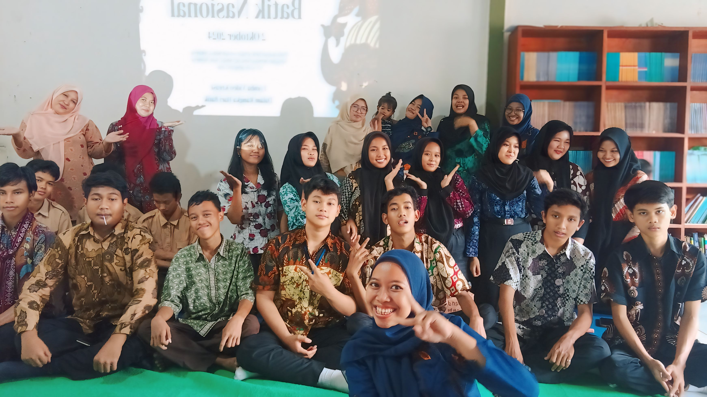

Dalam rangka memperingati Hari Batik Nasional yang jatuh pada tanggal 2 Oktober, SMK BIMA Kutabumi mengadakan kegiatan bertema "Bangga Berbatik, Bangga Berbudaya". Seluruh siswa dan guru turut serta memeriahkan acara dengan mengenakan batik sebagai bentuk kecintaan terhadap warisan budaya Indonesia.

[row]
[col]

[/col]
[/row]