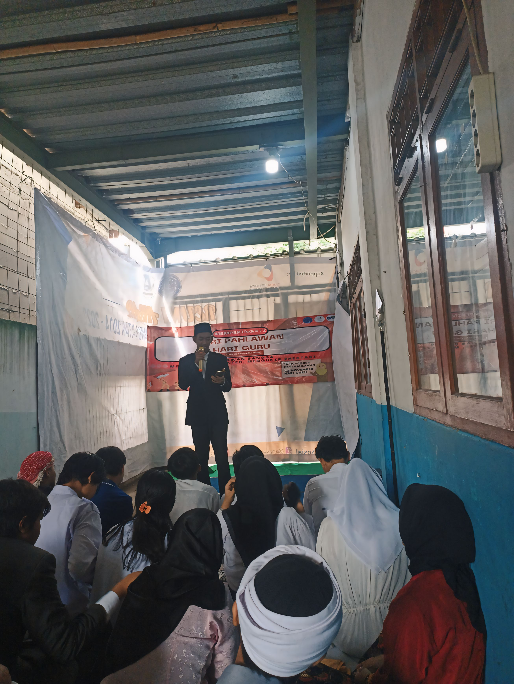

Dalam rangka memperingati Hari Pahlawan yang jatuh setiap tanggal 10 November, SMK Bina Mandiri Kutabumi Pasar Kemis Kabupaten Tangerang mengadakan serangkaian kegiatan yang bertujuan untuk mengenang jasa para pahlawan bangsa. Kegiatan ini juga sebagai bentuk penghormatan kepada perjuangan para pahlawan dalam merebut dan mempertahankan kemerdekaan Indonesia.

Peringatan Hari Pahlawan tahun ini diisi dengan upacara bendera yang penuh khidmat, lomba baca puisi bertema kepahlawanan, serta pemutaran film dokumenter perjuangan kemerdekaan. Tak ketinggalan, siswa juga membuat karya poster bertema "Semangat Kepahlawanan di Era Modern".

Melalui kegiatan ini, diharapkan siswa dapat menumbuhkan rasa nasionalisme, menghargai jasa para pahlawan, dan menerapkan nilai-nilai perjuangan dalam kehidupan sehari-hari sebagai generasi penerus bangsa yang tangguh dan berkarakter.

[row]
[col]

[/col]
[/row]
